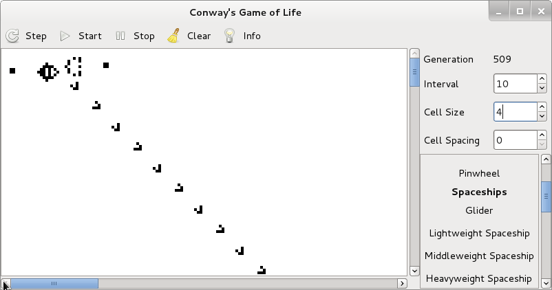

Conway's Game of Life
=====================

This is a simple simulator for Conway's Game of Life.



- Oscilators
  - Pentadecathlon
  - Plusar
  - Clock II
  - Pinwheel
- Spaceships
  - Glider
  - Lightweight Spaceship
  - Middleweight Spaceship
  - Heavyweight Spaceship
  - Small Flotilla
  - Large Flotilla
- Infinite Growth
  - GliderGun
  - Max
- Comutation
  - 1/4 Thin Gun
  - 1/8 Thin Gun
  - 1/12 Thin Gun
  - NOT Gate
  - AND Gate
  - OR Gate
  - Duplicator

Build
-----

This simulator depends on [GTK+2.0](http://www.gtk.org/).

```
$ make
$ ls gameoflife
gameoflife
```
